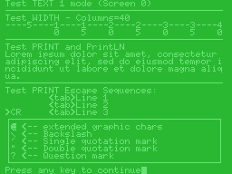
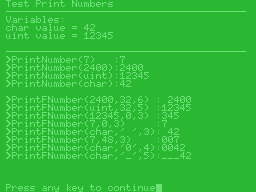
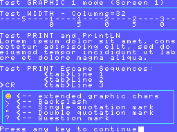
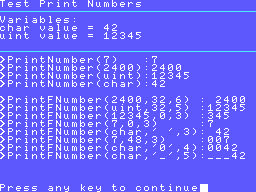
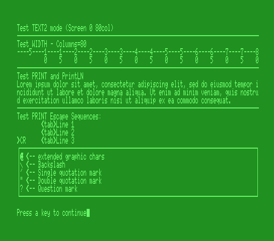

# TEXTMODE MSX SDCC Library (fR3eL Project)

<table>
<tr><td rowspan=2>Name</td><td>textmode_MSXBIOS</td></tr>
<tr><td>textmode_MSXDOS</td></tr>
<tr><td>Architecture</td><td>MSX</td></tr>
<tr><td>Environment</td><td>ROM, MSX BASIC or MSXDOS</td></tr>
<tr><td>Format</td><td>SDCC Relocatable object file (.rel)</td></tr>
<tr><td>Compiler</td><td>SDCC v4.4 or newer</td></tr>
</table>

 

---

## Description

C function library with functions for developing text-mode applications.
Includes functions for screen initialization and printing of texts and numbers.

Supports the following display modes:
- Text1 (Screen 0, 40 columns) 
- Text2 (Screen 0, 80 columns) Requires MSX with V9938 and BIOS that supports this mode.
- Graphic1 (Screen 1, 32 columns)

In this project you will find two libraries for different environments:
- **textmode_MSXBIOS** Uses the MSX BIOS. It takes up very little memory. You can use it to develop applications in ROM format or programs that run from MSX BASIC environment.
- **textmode_MSXDOS** Uses the MSX BIOS functions via inter-slot call (CALSLT). You can use it to develop applications for the MSX-DOS environment.

Use this library for developing MSX applications using Small Device C Compiler [`SDCC`](http://sdcc.sourceforge.net/).

You can access the documentation here with [`How to use the library`](docs/HOWTO.md).

These libraries are part of the [MSX fR3eL Project](https://github.com/mvac7/SDCC_MSX_fR3eL).

This project is open source under the [MIT license](LICENSE).
You can add part or all of this code in your application development or include it in other libraries/engines.

Enjoy it!

| NOTE |
| :--- | 
| For the number printing function, I have adapted a routine to convert a 16-bit value to ASCII taken from the [Baze's Z80 routine collection](http://baze.sk/3sc/misc/z80bits.html#5.1). |

 

---

## History of versions:

### textmode_MSXBIOS

- v1.5 (24/02/2024) bchput recovery, add GetColumns, GetCursorRow and GetCursorColumn.
- v1.4 (24/11/2023) Update to SDCC (4.1.12) Z80 calling conventions, add PrintLN function, remove bchput, and more improvements.
- v1.3 (05/09/2019) Integer printing functions improved (PrintNumber & PrintFNumber). num2Dec16 becomes PrintFNumber.
- v1.2 (03/04/2018)
- v1.1 (27/02/2017)
- v1.0 (??/??/????)

 

### textmode_MSXDOS

- v1.5 (22/10/2024) Update to SDCC (4.1.12) Z80 calling conventions, add functions: PrintLN, GetColumns, GetCursorRow and GetCursorColumn.
- v1.4 (04/09/2019) Integer printing functions improved (PrintNumber & PrintFNumber). num2Dec16 becomes PrintFNumber
- v1.3 (29/08/2019) nakeds and PrintNumber improvements
- v1.2 (05/05/2018)
- v1.1 (27/02/2017)
- v1.0 (??/??/????)

 

---

## Requirements

- [Small Device C Compiler (SDCC) v4.4](http://sdcc.sourceforge.net/)
- [Hex2bin v2.5](http://hex2bin.sourceforge.net/)

 

---

## Functions

| Function | Description |
| :---     | :---        |
| **WIDTH**(columns) | Specifies the number of characters per line in text mode |
| **COLOR**(ink, background, border) | Specifies the colors of the foreground, background, and border area |
| **SCREEN0**() | Initialice TEXT 1 (40 columns) or TEXT 2 (80 columns) screen mode |
| **SCREEN1**() | Initialice GRAPHIC 1 screen mode (32 columns x 24 lines) |
| **CLS**() | Clear Screen. Fill Pattern Name Table with 0x20 character |
| **LOCATE**(column, line) | Moves the cursor to the specified location |
| **PRINT**(text) | Displays a text string at the current cursor position |
| **PrintLN**(text) | Displays a text string at the current cursor position and adds a new line |
| **PrintNumber**(number) | Displays an unsigned integer at the current cursor position |
| **PrintFNumber**(number, emptyChar, length) | Displays an unsigned integer with formatting parameters, at the current cursor position |
| **bchput**(character) | Displays one character |
| **GetColumns**()      | Provides the columns from current screen           |
| **GetCursorRow**()    | Provides the current row-position of the cursor    |
| **GetCursorColumn**() | Provides the current column-position of the cursor |

 

---

## Code Example

Within the version directories by environment, you'll find programs I used for library testing that can serve as examples for learning how to use it.

 

### textmode_MSXBIOS

#### testLib 

Test the library functions in Text 1 (Screen 0 with 40 columns) and GRAPHIC 1 (Screen 1) modes of the TMS9918A.

[`Sourcecode`](MSXBIOS/examples/testLib)

 

 

#### test80c

Test the library functions in Text 2 mode (Screen 0 with 80 columns) of V9938 or higher.

[`Sourcecode`](MSXBIOS/examples/test80c)

 

### textmode_MSXDOS

#### testLib

Test the library functions in Text 1 (Screen 0 with 40 columns) and GRAPHIC 1 (Screen 1) modes of the TMS9918A.

[`Sourcecode`](MSXDOS/examples/testLib)

 

#### test80c

Test the library functions in Text 2 mode (Screen 0 with 80 columns) of V9938 or higher.

[`Sourcecode`](MSXDOS/examples/test80c)

